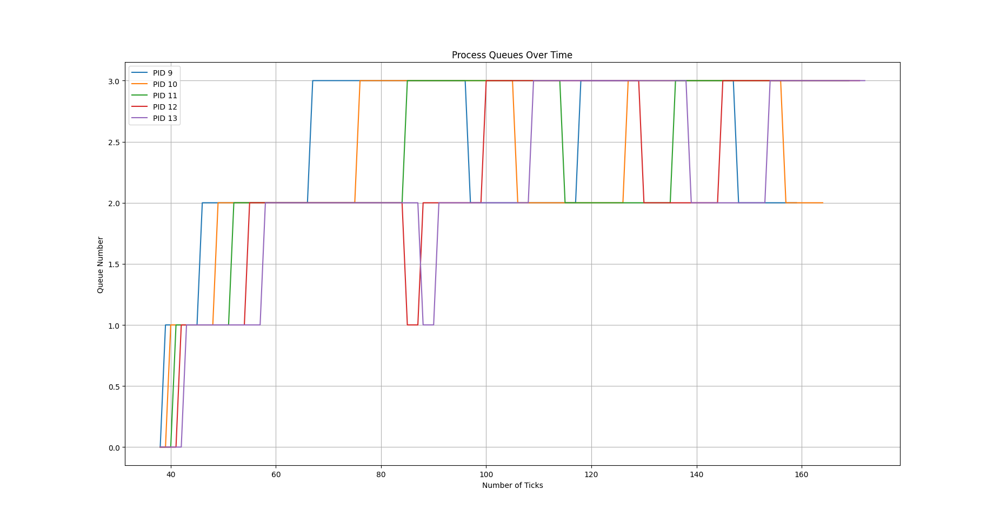

# XV6 Operating System - Custom Scheduling Algorithms

**Student Name:** Divyarajsinh Mahida
**Roll Number:** 2022101085

This project enhances the XV6 operating system by implementing two custom scheduling algorithms, First Come First Serve (FCFS) and Multi-Level Feedback Queue (MLFQ), and allows selecting one of them at compile time.

## First Come First Serve (FCFS)

In FCFS, processes are scheduled based on their creation time. The process that was created first gets to execute first.

**Implementation Overview:**

1. Introduced a new variable `ctime` in the `struct proc` to store the creation time of each process.
2. Modified the `allocproc` function to initialize `ctime` with the current `ticks`.
3. In the `scheduler` function, iterated through all processes to find the one with the smallest `ctime` that is also in the `RUNNABLE` state.
4. Performed a context switch to the selected process, changing its state to `RUNNING`.
5. Disabled process preemption by removing the call to `yield` in the `trap.c` file, ensuring the selected process runs to completion.

## Multi-Level Feedback Queue (MLFQ)

MLFQ is a priority-based scheduling algorithm that schedules processes based on their priority queues. The process with the highest priority within the non-empty queue is selected for execution.

**Implementation Overview:**

1. Introduced new variables in the `struct proc` to manage MLFQ: `w` to account for wait ticks, `wait` to track how long a process has already run, and `queue_num` to store the queue number of a process. These variables are initialized in the `allocproc` function.
2. In the `scheduler` function, the scheduler chooses the process by finding the smallest non-empty priority queue and selecting the process with the largest `ticks_done` count in that queue.
3. Upon selecting a process, it is context switched (state changed to `RUNNING`) and its wait time (`w`) is reset to 0.
4. In the `trap.c` file, various modifications are made to handle MLFQ:
   - Increase `w` by 1 for all `RUNNABLE` processes.
   - Check if the waiting time of any process exceeds an "AGING" limit. If it does, promote the priority queue (decrease `queue_num`) and reset variables (`w`).
   - Increase `wait` by 1 for the currently running process.
   - Check if the running process has exceeded its time slice based on the queue. If it does, decrease the priority and modify related variables.
   - Call the `yield` function to schedule the next process.
   - Ensure that processes in the `BLOCKED` state that become `RUNNABLE` during the execution of another process with higher priority are scheduled immediately.

# # Scheduling Algorithm Performance Comparison

 In this project, we've implemented and compared three popular scheduling algorithms: Round Robin (RR), First-Come, First-Served (FCFS), and Multi-Level Feedback Queue (MLFQ). The comparison is based on their average response time (rtime) and average waiting time (wtime).

## (rtime)

- **Round Robin (RR):** 12
- **First-Come, First-Served (FCFS):** 12
- **Multi-Level Feedback Queue (MLFQ):** 12

All three algorithms exhibit similar average response times, with each having an rtime of 12. This means that, on average, processes have similar response times across these scheduling algorithms.

## (wtime)

- **Round Robin (RR):** 150
- **First-Come, First-Served (FCFS):** 125
- **Multi-Level Feedback Queue (MLFQ):** 149

Here's how the average waiting times compare:

- **FCFS** stands out with the lowest average waiting time (125), indicating that processes spend less time waiting in the queue before execution.
- **RR** has a somewhat higher average waiting time (150) compared to FCFS, implying that processes, on average, wait longer in the queue before getting a chance to execute.
- **MLFQ** demonstrates a waiting time (149) close to that of RR, suggesting a similar average waiting time.

In conclusion:

- **FCFS** performs exceptionally well in terms of average waiting time, offering the lowest waiting time for processes.
- **RR** and **MLFQ** exhibit similar average waiting times, with RR having a slightly higher average waiting time.

